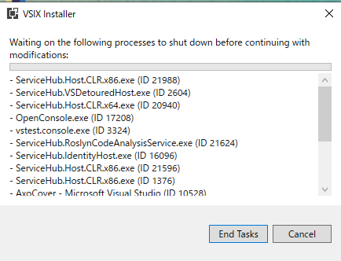

# カバレッジ測定ツール[AxoCover](https://marketplace.visualstudio.com/items?itemName=axodox1.AxoCover)をVisual Studio 2019で利用する方法

## 1.前書き

Visual Studioアドイン[AxoCover](https://marketplace.visualstudio.com/items?itemName=axodox1.AxoCover)はVisual Studio 2012 ～ 2017で利用できる、カバレッジ測定ツールです。Enterprise版を購入できない場合、とても頼りになります。

* ユニットテストを実行すると、クラス、メソッド毎にカバレッジ率を表示することができる。
* カバレッジ測定自体は[opencover](https://github.com/OpenCover/opencover)を利用しているようです。アドオンとして統合されているAxoCoverを使えば、存在を意識せずに測定ができます。

* 困ったことにVS2019にはインストールできません。

ここ数年ほどメンテナンスされていないためです。
[githubのissueでVS2019対応](https://github.com/axodox/AxoCover/pull/206)について議論されており、pre-releaseとして[master-1.1.400](https://github.com/axodox/AxoCover/releases/tag/master-1.1.400)が公開されています。

VS2019で非推奨となったAPIを利用しているため起動時に警告が表示されますが、動作自体に問題はなさそうでした。
(同期ロードAPIを利用しているため、VisualStudio起動時のパフォーマンスに影響があるようです)

## 2.インストール方法
Visual Studio 2019の「拡張機能の管理」からはインストールができないため、拡張機能(.vsix)をgithubからダウンロードします。

* 1.`AxoCover.vsix`のダウンロード

  [AxoCover.vsix](https://github.com/axodox/AxoCover/releases/download/master-1.1.400/AxoCover.vsix)を、githubからダウンロードします

* 2.インストール
  
  ダウンロードしたファイルをダブルクリックしてインストールを行います

  

* 「Install」をクリック

  

* 下記画面はインストールを妨げているプロセスを終了する確認画面

  

  Visual Studioを手動で終了すると次へ進みます(もしくはEnd Tasksで強制終了して次へ進みます)

* インストール中画面

  

* インストール完了画面

  

* Visual Studio 2019を起動後の警告表示

  

  ここでは「同期自動読み込みを許可」をクリックして、アドオンの読み込みを継続します。

* AxoCoverの表示

  

  「ツール」メニューから選択して表示します

* 初回起動時の確認画面

  

  エラー時にtelemetryを送るかどうか選択して「OK」をクリックします。

* AxoCoverアドオン画面(UnitTestが存在しない場合)

  ソリューション内にUnitTestがない場合、テストコードが見つかりませんよ？という確認の画面が表示されます。

  

* AxoCoverアドオン画面(UnitTestが存在する場合)

  UnitTestがある場合は自動的に検出されて、テストがツリー表示されます

  

## 3.簡単な動作確認手順

＾

